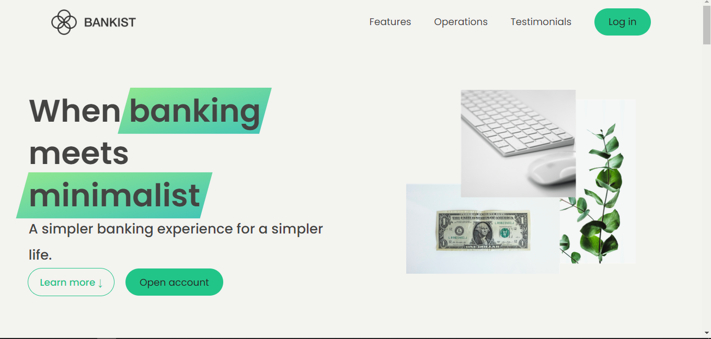

# Bankist Website

Welcome to the Bankist Website! This website showcases the key features and aesthetics of the Bankist application. It provides a glimpse into the possibilities and functionality of the app.

## Features

The Bankist website demonstrates the following features:

- Account Creation: Users can create an account on the website. Please note that the created accounts are not persistent and exist solely for demonstration purposes.
- Aesthetically Designed Interface: The website boasts a clean and visually appealing design. Its simplistic and intuitive layout ensures easy navigation and an enjoyable user experience.
- Key Features Display: The website highlights the key features of the Bankist application. Users can explore and understand the functionalities and benefits of the app.
- Testimonials: Fictional user testimonials are showcased on the website. These testimonials provide insights into the positive experiences of users who have utilized the Bankist application.

## Getting Started

To get started with the Bankist website, follow these steps:

1. Clone the Repository: Clone the Bankist website repository to your local machine using the following command:

2. Open the Website: Once the repository is cloned, navigate to the project directory and open the `index.html` file in your preferred web browser.

3. Explore and Enjoy: Browse through the different sections of the website to explore the features, testimonials, and design. Interact with the website to experience its easy navigation and aesthetic appeal.

Please note that the Bankist website is purely a demonstration and does not connect to any backend systems or persist user data. It serves as a visual representation of the Bankist application's features and design.

## Contributing

As the Bankist website is a fictional representation, contributions are not expected. However, if you have any ideas or suggestions, feel free to share them with us.

## License

The Bankist website is released under the [MIT License](LICENSE). You are free to use, modify, and distribute the code as per the terms of the license.

Thank you for visiting the Bankist website!

